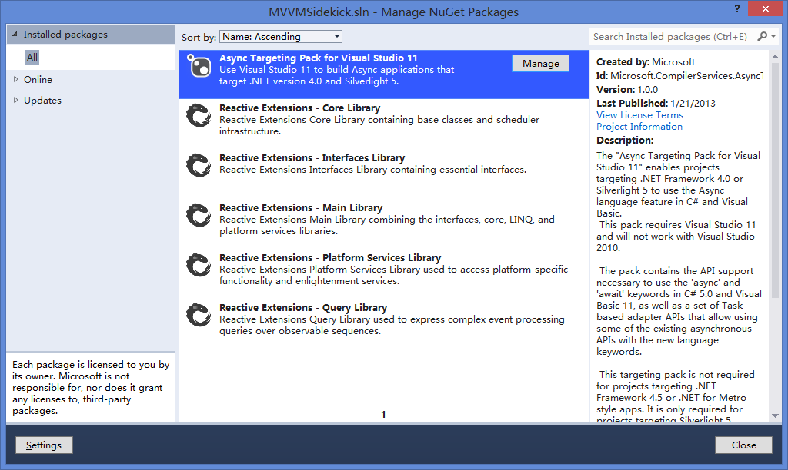
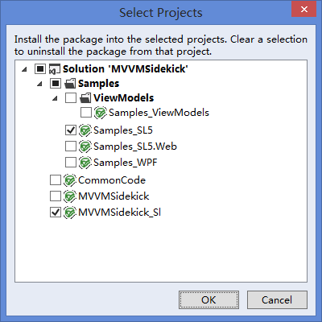
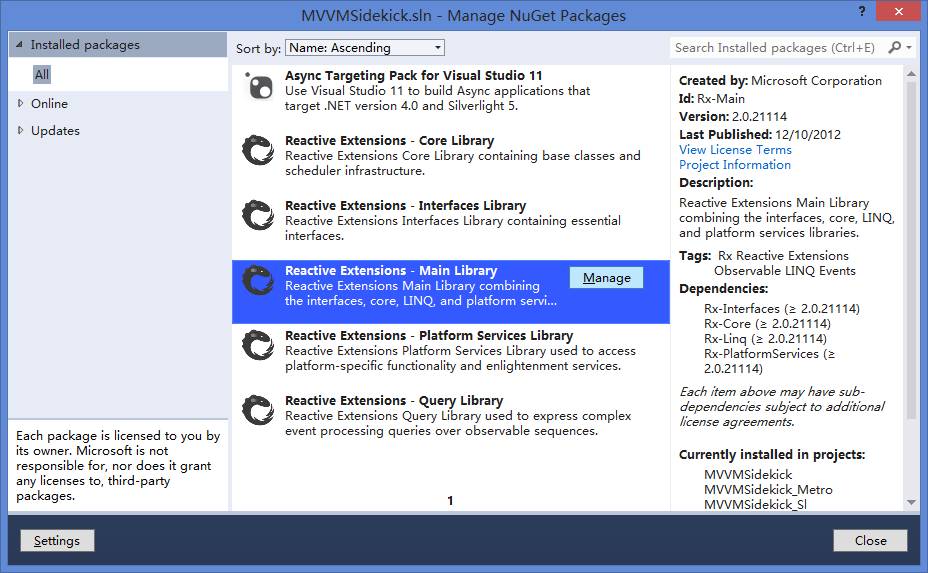
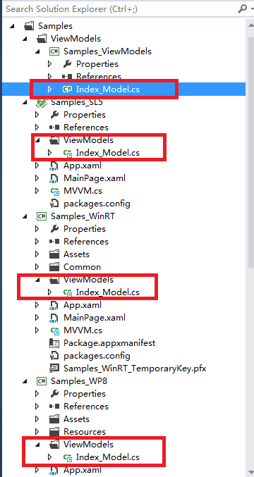

#Create a Caculator with MVVM-Sidekick Code File From nothing#
>#从0开始,使用纯代码的MVVM-Sidekick建立一个计算器#

*Like JS frameworks,it is kinda cool to  have no dlls but framework code files in your project, cos if you guys wanna change anything you can do it in code immediatly, without compile and depoly,reference refreshment stuff. We provide a single code file for all platforms, easy to install and uninstall, just add it or delete in your projects.(Of course we provide nuget dll reference package too. )*

>*和JS框架类似，作为一个前端框架，如果能够直接以代码文件而不是Dll引用的方式直接加入工程是挺酷的一件事。如果你有啥东东想要修改，直接在工程里改就齐了，不必开工程编译啊发布啊刷新引用啊，那么麻烦。我们提供了一个单独代码文件，直接将其加入你的工程就算安装了框架，删除了就算卸载，管理简单。(当然也有nuget的dll 引用 package)*

## Very first step: Create a empty project  ##
>## 千里跬步: 创建工程 ##

### 1 .Create a project of your target platform, add basic references, and set Conditional compilation symbols.###

>###1 . 创建一个目标工程，添加基础引用，在工程中设置条件编译符号。###

*MVVM-Sidekick now supports Silverlight 5, Windows Phone 8, WPF 4.5, and Windows Runtime XAML. We only support C Sharp offically, but it is not that hard to intergrade to VB.*
>*MVVM-Sidekick 现在支持的平台包括 Sliverlight 5, Windows Phone 8, WPF 4.5, 以及Windows Runtime Xaml程序。我们官方仅仅支持CSharp使用，但是根据我们的支持集成到VB也绝非难事*

<table border="3" align="center">
<thead><td>Platform/平台 </td><td>Basic References/基础引用</td><td>Symbol/符号</td></thead>
<tr><td>Silverlight 5</td><td>
System.Runtime.Serialization 
Microsoft.CSharp 
System.Windows.Controls.Navigation
</td><td>SILVERLIGHT_5</td></tr>
<tr><td>WPF 4.5</td><td>System.Runtime.Serialization </td><td>WPF</td></tr>
<tr><td>Windows Phone 8</td><td>System.Runtime.Serialization </td><td>WINDOWS_PHONE_8</td></tr>
<tr><td>Windows RT XAML</td><td>-</td><td>NETCORE_FX</td></tr>
</table>

Figure 1
  Input conditional compilation symbols <HERE> 
在<这里>输入条件编译符号

###2 . [SL5] Add async await support to your project###

>###2 . [SL5] 为工程添加 async await 关键字支持###

*In Silverlight 5 projects and Wpf 4.0,  async await key words are not supported by default because awaitable TPL class are newly added since .net 4.5. You can add support in vs2012 by nuget, instead.*
>*在 Silverlight 5 或者 Wpf 4.0工程里, VS并不默认支持 async await 关键字，这是因为TPL的awaitable 类型支持是在.net 4.5新加入的. 作为替代，你可以用nuget来为你的SL5工程添加这种支持.*

**Open :`VS Menu-> TOOLS->Libary Package Manager ->Manage Nuget Packages For Solution`**

**Search & Install:`Online:Microsoft.CompilerService.Async`**

**Click Manage :`Installed packages, All:Microsoft.CompilerService.Async`**

 
Figure 2. Add nuget package, 

 
Figure 3. Target project of async support.

###3 .  Add RX to your project###

>###3 . 为工程添加 RX 支持###

**Open :`VS Menu-> TOOLS->Libary Package Manager ->Manage Nuget Packages For Solution`**

**Search & Install:`Online:Rx-Main`**

**Click Manage :`Installed packages, All: Rx-Main`**

 
Figure 4. Add nuget package, Rx-Main

 
Figure 5. Target projects of Rx .

###4 .  Add MVVM.cs To your project.###

>###4 . 为工程添加 MVVM.cs ###

**Open :`VS Menu-> PROJECT->Add Existing Item ->MVVM.cs(Add as Link)`**
###5 .  Try Build your Project.###

>###5 . 尝试编译你的项目 ###

## Second step: Create entrance View & View Model  ##
>## 第二步: 创建总视图与视图模型 ##

###1 .  Create MVVM-Sidekick View Model

>###1 . 创建MVVM-Sidekick视图模型 ###

**`VS Menu-> PROJECT->New Folder->Set Name:ViewModels`**

**`VS Menu-> PROJECT->Add New Item->Class ->Set Name:Index_Model`**

*Usually all the View Models in different platforms can be same, it is possiable to add one new View Model class file in Samples_ViewModels.csproj and add it as link to other projects. Some platform sepific API or logic can be written and orgnazined in the same file with contitional compliation symbols .*

>*大多数情况，对应不同平台的视图模型有可能是完全一样的，我们把这样的视图模型放在一个工程，在其他工程中按照链接添加代码文件是可行的。对于平台特有的API和逻辑，我们可以用条件编译符号组织它们。*

 
Figure 6. Add View Model class as link.

Change old code
>将代码
<pre>
<code>
using System;
using System.Collections.Generic;
using System.Linq;
using System.Text;
using System.Threading.Tasks;

namespace Samples.ViewModels
{
    public class Index_Model
    { 
    }
}
</code>
</pre>
To new code
>修改为
<pre>
<code>
using MVVMSidekick.ViewModels;
using System;
using System.Collections.Generic;
using System.Linq;
using System.Text;
using System.Threading.Tasks;

namespace Samples.ViewModels
{
  	public class Index_Model : ViewModelBase &lt;Index_Model&gt;
    {
	}    
}

</code>
</pre>

*You can use code snippet `vmcls` to make this quick. The code snippet is in folder：  

>*可以使用vmcls代码块简化这一步骤。代码块路径为：

`MVVM-Sidekick\MVVMSidekick\CommonCode\MVVM.snippet`*

`vmcls [tab] [tab]`

Add new property to this View Model class
>在这个视图模型中添加新属性
<pre>
<code>
  	public class Index_Model : ViewModelBase &lt;Index_Model&gt;
    {
        public string HelloWorld
        {
            get { return _HelloWorldLocator(this).Value; }
            set { _HelloWorldLocator(this).SetValueAndTryNotify(value); }
        }
        #region Property string HelloWorld Setup
        protected Property<string> _HelloWorld = new Property<string> { LocatorFunc = _HelloWorldLocator };
        static Func<BindableBase, ValueContainer<string>> _HelloWorldLocator = RegisterContainerLocator<string>("HelloWorld", model => model.Initialize("HelloWorld", ref model._HelloWorld, ref _HelloWorldLocator, _HelloWorldDefaultValueFactory));
        static Func<string> _HelloWorldDefaultValueFactory = ()=>"Hello Mvvm world";
        #endregion
	}

</code>
</pre>

*You definitely need our code snippets support. We cannot type this s🚾🚾t by ourselves. The magic word is p❤r❤o❤p❤v❤m*
>*你肯定得用我们的代码块了，上面这一砣🚾我们自己都无法打出来。跟我们一起念咒语 p❤r❤o❤p❤v❤m*

`propvm [tab] [tab]`

*Tips: you can set one Default Value Factory of each property. If you need view model state you can use `Func<BindableBase,TProperty>`, and if you need not you can use `Func<TProperty>`. Both are supported with `RegisterContainerLocator<TProperty>` function*

*小提示：你可以为每一个属性创建一个默认值工厂， 如果您创建默认值的时候需要当前VM的状态，你可以用 ‘Func<BindableBase,TProperty>’类型的代理，否则您只需要用‘Func<TProperty>’代理。此两者都被`RegisterContainerLocator<TProperty>` 函数支持*

###2 .  Create/Modify MVVM-Sidekick View

>###2 . 创建/修改MVVM-Sidekick视图

####[SL5] Modify MainPage.xaml to Mvvm-Sidekick View####
>####[SL5] 修改MainPage.xaml成为Mvvm-Sidekick视图####

1. Open MainPage.xaml in IDE Designer.
2. Add namespace in root element 'UserControl' ` xmlns:mvvm="clr-namespace:MVVMSidekick.Views" `
3. Change 'UserControl' to 'mvvm:MVVMControl'
4. Open MainPage.xaml.cs in IDE Code editor.
5. Add using namespace line: `using MVVMSidekick.Views;`
6. Change   `public partial class MainPage : UserControl`   to  `public partial class MainPage : MVVMControl`

>1. 在设计器打开 MainPage.xaml 
>2. 在代码根元素 'UserControl'中增加命名空间  ` xmlns:mvvm="clr-namespace:MVVMSidekick.Views" `
>3. 将 'UserControl' 根元素 修改为'mvvm:MVVMControl'
>4. 在代码编辑器打开 MainPage.xaml.cs
>5. 在代码头部增加命名空间using : `using MVVMSidekick.Views;`
>6. 将代码   `public partial class MainPage : UserControl`   修改为  `public partial class MainPage : MVVMControl`

